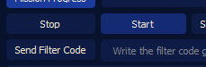

# Ground Station User Interface & Raspberry Pi Setup Guide

This guide provides comprehensive instructions for setting up and operating the **Ground Station User Interface (UI)**
and **Main Computer of Science Payload (Raspberry Pi)**. It was developed by **Jaydeep Solanki(me)**, leveraging the
assistance of **modern GPTs** and **reference online codes**, specifically for the **Teknofest 2024 Model Satellite
Competition**.

---

## Table of Contents

1. [Core Files](#core-files)
    - [UI (User Interface)](#ui-user-interface)
    - [Raspberry Pi](#raspberry-pi)
2. [Setup Instructions](#setup-instructions)
    - [Ground Station UI Setup](#ground-station-ui-setup)
    - [Raspberry Pi Setup](#raspberry-pi-setup)
3. [Simulating Telemetry Data](#simulating-telemetry-data)
4. [Troubleshooting](#troubleshooting)
    - [UI Not Launching](#ui-not-launching)
    - [Raspberry Pi Issues](#raspberry-pi-issues)
5. [File Modifications](#file-modifications)
6. [Images for Visual Reference](#images-for-visual-reference)
7. [Contact](#contact)
8. [Team Information](#team-information)

---

## Core Files

This repository contains the primary code for both the Ground Station UI and the Raspberry Pi, designed to operate
together for telemetry data monitoring and processing.

### UI (User Interface)

1. **[mainwindow.py](./UI/mainwindow.py)**  
   The main script responsible for launching the Ground Station UI. It provides real-time monitoring of telemetry data
   from the cansat.

2. **[csv_file_simulation_gui.py](./UI/csv_file_simulation_gui.py)**  
   A simulation tool for testing telemetry data by reading and displaying data from a CSV file in the Ground Station UI.

3. **[requirements.txt](./UI/requirements.txt)**  
   Contains the necessary Python libraries and dependencies for the UI to function properly. Install these using the
   instructions provided in the Setup section.

---

### Raspberry Pi

1. **[maincode.py](./RPI/maincode.py)**  
   This script handles telemetry communication from the cansat to the ground station. It waits for a start signal from
   the Ground Station UI.

2. **[install_setup_libraries.sh](./RPI/install_setup_libraries.sh)**  
   A shell script that installs all necessary libraries on the Raspberry Pi for executing the main telemetry code.

3. **[rtc_set_time.py](./RPI/rtc_set_time.py)**  
   This script sets the Raspberry Pi's RTC to the correct time zone (Europe/Istanbul). It should be run at the initial
   setup.

---

## Setup Instructions

### Ground Station UI Setup

1. **Install Python 3.10+**  
   Ensure that **Python 3.10** or higher is installed on your machine. Use the command below to check your Python
   version:

   ```bash
   python --version
   ```

2. **Create a Virtual Environment**  
   Creating a virtual environment helps to manage project dependencies efficiently:

   ```bash
   pip install virtualenv
   python -m venv venv
   ```

   Activate the virtual environment:

    - For **Windows**:
      ```bash
      venv\Scripts\activate
      ```

    - For **macOS/Linux**:
      ```bash
      source venv/bin/activate
      ```

3. **Install Required Dependencies**  
   Once the virtual environment is activated, install the necessary packages using:

   ```bash
   pip install -r requirements.txt
   ```

4. **Launch the Ground Station UI**  
   Run the following command to start the Ground Station UI:

   ```bash
   python mainwindow.py
   ```

   The UI will initialize, and you can begin monitoring satellite telemetry data by pressing the "Start" button.

---

### Raspberry Pi Setup

1. **Transfer Setup Script**  
   Transfer the `install_setup_libraries.sh` script to your Raspberry Pi using SSH, SCP, or a USB drive.

2. **Run Setup Script**  
   Give execution permissions to the script:

   ```bash
   chmod +x install_setup_libraries.sh
   ./install_setup_libraries.sh
   ```

   This will install all necessary libraries for the Raspberry Pi to function as the satellite's main computer.

3. **Run `rtc_set_time.py`**  
   Once libraries are installed, run the script to set the RTC timezone:

   ```bash
   sudo python rtc_set_time.py
   ```

4. **Start `maincode.py`**  
   After setting the RTC, start the telemetry process using:

   ```bash
   sudo python maincode.py
   ```

---

## Simulating Telemetry Data

To test the Ground Station UI, you can simulate telemetry data using the **CSV simulation tool**. Here’s how:

1. **Activate the virtual environment**  
   Follow the setup instructions above to activate the environment.

2. **Run the Simulation Script**  
   Execute the CSV simulation tool with:

   ```bash
   python csv_file_simulation_gui.py
   ```

3. **Select and Simulate CSV**
    - Choose the CSV file by clicking the "Select File" button.
    - The CSV should have the following format:

   ```csv
   Packet_count,Satellite_Status,Error_Code,Mission_Time,Pressure1,Pressure2,Altitude1,Altitude2,Altitude_Difference,Descent_rate,Temperature,Battery_Voltage,Gps_Latitude,Gps_Longitude,Gps_Altitude,Pitch,Roll,Yaw,LNLN,Iot_Data,Team_Number
   ```

4. **Monitor Telemetry in Real-Time**  
   The data will flow into the UI for real-time monitoring.

---

## Troubleshooting

### UI Not Launching

- Ensure that all required libraries are installed.
- Verify the integrity of `mainwindow.py` and `requirements.txt`.
- Reinstall the dependencies if necessary:

  ```bash
  pip install -r requirements.txt
  ```

### Raspberry Pi Issues

- Check the output of `install_setup_libraries.sh` for errors during installation.
- Ensure the Raspberry Pi is properly connected to the internet when setting the RTC time.

---

## File Modifications

Be cautious when modifying core files. Make changes only if you are familiar with the system:

- **UI Modifications**: Follow the [Modifying the UI Main File](#modifying-the-ui-main-file) section.
- **Raspberry Pi Scripts**: Ensure that any modifications are tested on both UI and Raspberry Pi environments.

---

## Modifying the UI Main File

### Editing [mainwindow.py](./UI/mainwindow.py)

To safely edit the `mainwindow.py` file:

1. Open the file in a code editor like VS Code or Notepad.


2. Search for the IP address using `Ctrl+F`.Readme Files/image-4.pngadme Files/image-4.png)

3. Replace the existing IP address with the new one by copying the current IP and using `Ctrl+H` (or `Ctrl+R` in
   Notepad) to replace it throughout the file.
   <Readme Files/image-5.pngadme Files/image-5.png)
4. Editing Map Tile
   <br>
   i. [mainwindow.py](./UI/mainwindow.py)
   <br>
   ii. [csv_file_simulation.py](./UI/csv_file_simulation.py)
   <br>

---

## Images for Visual Reference

Refer to the following images for detailed understanding:

- **File Selection**  
  

- **Start Simulation**  
  

- **Data Flow in UI**  
  

---

## Contact

For any inquiries or permissions, please contact:

- **Name**: Jaydeep Solanki
- **Email**: jaydeep.solankee@yahoo.com
- **LinkedIn**: www.linkedin.com/in/solanki-jaydeep

---

## Team Information

- **Team Name**: Team Dyaus
- **Institute**: Institute of Technology Nirma University
- **Team Instagram**: https://www.instagram.com/teamdyaus/
- **Team Email**: teamdyaus.itnu@gmail.com
- **Team LinkedIn**: https://www.linkedin.com/company/team-dyaus-itnu/

---

*Note: Certain files, such as the payload design and UI design files, have not been included in this repository for
authentication reasons. As a result, the code may not run as intended without them. Please use this as a reference
only.*

